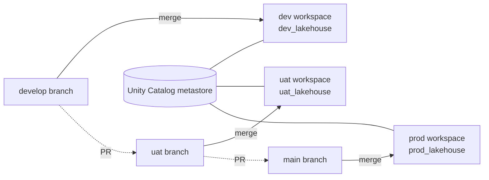

# Databricks Lakehouse Platform

Multi-workspace Databricks setup on Azure with dev, uat and prod environments, a bronze / silver / gold data model, and CI/CD with GitHub Actions.

## Approach

**Environments.** Each environment has its own workspace, storage account, key vault and Unity Catalog catalog (`dev_lakehouse`, `uat_lakehouse`, `prod_lakehouse`). All three workspaces share one regional metastore. Each catalog is bound to its own workspace, so prod data can't be read from dev.

**Medallion layers.** Each catalog has `bronze`, `silver` and `gold` schemas, each stored in its own container.
- `bronze`: raw data. Orders are ingested with Auto Loader from a landing volume, and customers from a SQL database over JDBC.
- `silver`: cleaned and de-duplicated, merged on `order_id`.
- `gold`: daily sales aggregate, followed by a few SQL quality checks on the warehouse.

**Terraform vs. asset bundles.** I split the work into two parts:
- **Terraform** (`infra/terraform`) handles platform resources that change rarely: workspaces, storage, catalogs, schemas, grants, secret scopes, cluster policies and the SQL warehouse.
- **Asset bundles** (`databricks.yml`, `resources/`) handle jobs, job clusters and pipeline code, which change often.

The bundle looks up the cluster policy and warehouse by name. Those names are the same in every workspace, so the same bundle deploys to all three environments.

Terraform has two stacks per environment:
- `foundation`: Azure resources plus account-level setup.
- `workspace`: configuration inside the workspace.

Splitting them avoids configuring the Databricks provider from a workspace that's created in the same apply.

**Secrets.** Secret values live only in each environment's Key Vault. Databricks reads them through a Key Vault-backed secret scope called `kv-lakehouse`, which has the same name everywhere. Nothing secret is stored in Git, GitHub or Terraform state.

**CI/CD.** Each environment has its own long-lived branch, and merging into it deploys to that environment's workspace:

| Branch | Deploys to | Catalog |
|---|---|---|
| `develop` | dev workspace | `dev_lakehouse` |
| `uat` | uat workspace | `uat_lakehouse` |
| `main` | prod workspace | `prod_lakehouse` |

Code moves forward through pull requests:

```
feature/*  --PR-->  develop  --PR-->  uat  --PR-->  main
```

- A CI check rejects PRs that skip a step, for example a feature branch straight into `main`. The only exception is `hotfix/*` branches. A hotfix is merged back into `uat` and `develop` afterwards.
- Every PR runs lint, unit tests, `terraform validate`, a `terraform plan` against the target environment, and `bundle validate`.
- A merge runs Terraform `foundation`, then Terraform `workspace`, then `bundle deploy` for that branch's environment.
- After deploying to uat, the pipeline also runs `medallion_orders` once as an integration test.

GitHub Actions signs in to Azure with OIDC (federated credentials), so there are no client secrets. Each environment has its own service principal.

**Access**
- Dev: engineers have full access.
- UAT and prod: only the service principal writes. Engineers can read, and analysts can only read `gold`.
- Interactive clusters are allowed in dev only.



## Structure

```
databricks.yml              bundle config, targets dev / uat / prod
resources/                  job definitions
src/lakehouse/              bronze, silver, gold code (built as a wheel)
src/sql/                    SQL tasks (quality checks, maintenance)
tests/                      unit tests for the transformations
infra/terraform/
  modules/                  naming, unity_catalog, secrets, compute
  stacks/foundation/        workspace, storage, key vault, metastore assignment
  stacks/workspace/         catalog, schemas, grants, scopes, policies, warehouse
  environments/<env>/       tfvars + backend config per environment
.github/workflows/          ci.yml, cd.yml + reusable terraform / bundle workflows
```

## Running it

```bash
make install
make test
databricks auth login --host <dev workspace url>
make deploy ENV=dev
```

Terraform runs from CI. To run it locally:

```bash
cd infra/terraform/stacks/foundation
terraform init -backend-config=../../environments/dev/backend.hcl -backend-config="key=foundation.tfstate"
terraform plan -var-file=../../environments/dev/foundation.tfvars
```

## Assumptions

- Azure Databricks, Premium tier, with an existing Unity Catalog metastore in the region.
- `data-platform-engineers` and `data-analysts` groups are synced from Entra ID.
- One-time setup is done beforehand. See [docs/setup.md](docs/setup.md).
- Subscription, account and service principal IDs and workspace URLs are placeholders.

## With more time I would add

- Private Link and VNet injection for prod, with self-hosted runners.
- Separate service principals for deploying and for running jobs.
- Lakeflow / DLT pipelines with expectations instead of the plain SQL checks.
- Alerting and cost dashboards (system tables).
